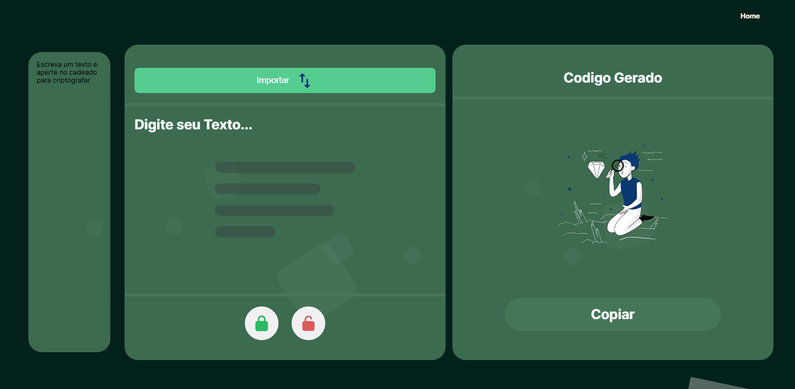

# CripTexto

## Descrição
O **CripTexto** é uma aplicação web desenvolvida para criptografar e descriptografar textos, além de oferecer funcionalidades adicionais como importação de arquivos PDF e TXT, manipulação de templates e geração de documentos em PDF, você pode usar Temas já prontos ou pode criar seu propios tema usando AI, isso usando um estilo propio de cbt ou seja com base no tema fonercido a AI gerar um tema usando um findTunner Especifico.

## Desafio da Alura

## Funcionalidades

- **Criptografar e Descriptografar:** Permite aos usuários inserir texto e realizar operações de criptografia e descriptografia utilizando métodos seguros.
- **Importação de Arquivos:** Suporta importação de arquivos nos formatos PDF e TXT para visualização e manipulação de conteúdo.
- **Templates de Documentos:** Oferece modelos pré-definidos para facilitar a criação de documentos padronizados.
- **Exportação em PDF:** Permite salvar documentos criados como arquivos PDF, com opção de proteção por senha para garantir a segurança dos documentos.
- **Desenho de Templates Personalizados:** Funcionalidade para desenhar templates personalizados diretamente na aplicação, permitindo a criação de layouts únicos.
- **Histórico de Templates:** Mantém um registro de templates criados, facilitando o acesso e a gestão de documentos anteriores.

## Tecnologias Utilizadas

- **Front-end:** HTML, CSS, JavaScript (ES6+)
- **Bibliotecas Externas:**
  - jsPDF: Para geração de documentos em PDF no navegador.
  - pdf.js: Para visualização e extração de texto de arquivos PDF.
  - SweetAlert2: Para exibição de alertas e prompts personalizados.
- **Armazenamento Local:** LocalDB.js para gerenciamento de banco de dados local no navegador, facilitando o armazenamento e recuperação de templates e configurações.
